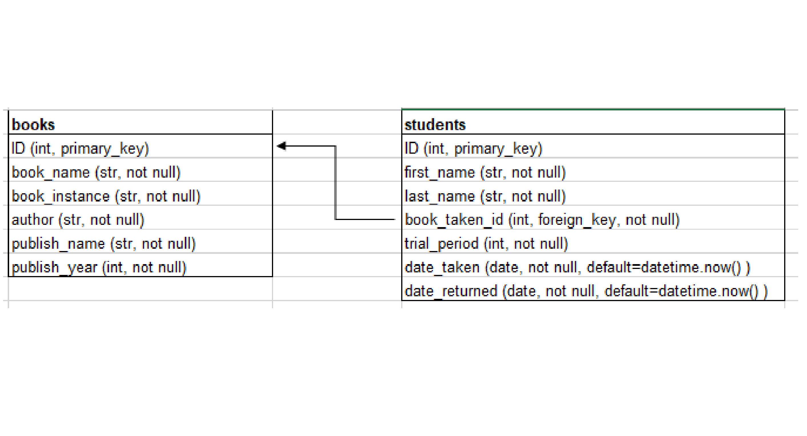

# library_task

A small repo dedicated to library task (scroll down for Russian version).

#### Technology stack:
* Language: Python 3.6
* Database: PostgreSQL 13.3
* Main libraries:
  - sqlalchemy
  - pytest

To check the answers please follow the steps:
* Install PostgreSQL 13.3 and launch the server (configurations for the server are in ```src/config/config.yaml```)
* Install dependencies with:
```bash
$ pip install -r requirements.txt
```
* Initialize database and tables:
```bash
$ cd library
$ python src/library_tables/init_db.py
$ python src/library_tables/create_tables.py
```
* You can either inspect the code with answers in ```src/library_tables/table_navigation.py``` 
or run ```pytest tests.py```

* The SQL schema for the task is shown below.


* By author's popularity per year in Task 2 we mean the number of times students took a single (or multiple) books
 of **one** author per given year.

* By "foul reader" in Task 3 we mean a student who did not return a book in time. We calculate the "foul degree" by
summarizing the number of days of not returning the book in time (we do it for all books of the student). The student
with the highest number of days without returning the book in time is "the foulest".

___

# library_task

Небольшой репозиторий для ответов на вопросы по заданию с библиотекой.

#### Стек технологий:
* Язык: Python 3.6
* Датабаза: PostgreSQL 13.3
* Основные библиотеки:
  - sqlalchemy
  - pytest

Для проверки ответов следуйте, пожалуйста, инструкции ниже:
* Установите PostgreSQL 13.3 и запустите сервер (конфигурации для сервера находятся в ```src/config/config.yaml```)
* Установите зависимости с помощью:
```bash
$ pip install -r requirements.txt
```
* Инициализируйте базу данных и таблицы с помощью:
```bash
$ cd library
$ python src/library_tables/init_db.py
$ python src/library_tables/create_tables.py
```
* Можете либо проверить ответы на задания в  ```src/library_tables/table_navigation.py```,
либо запустить ```pytest tests.py```

* SQL схема для выполнения задания показана на рисунке ниже.


* Под популярностью автора за год во втором задании понимается количество взятий разных книг **одного** автора студентами 
в течение заданного года.

* Под "злостным читателем" в третьем задании понимается тот студент, который просрочил сдачу книги обратно в библиотеку. 
Степень "злостности" рассчитывается путем подсчета количества просроченных дней по каждой из книг. Самым "злостным"
будет читатель с самой большой просрочкой.